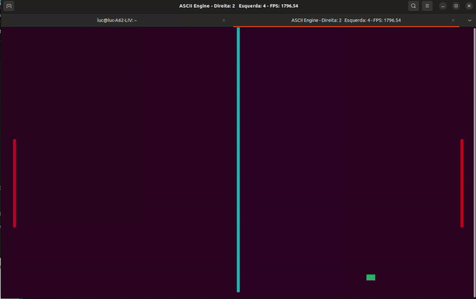

# ASCII Engine

Terminal engine that allows users to draw in the console using
ansi scape codes, with no external libraries required. Also key
inputs can be used interactively by using the terminal in raw mode.

## Pong

A simple pong game was implemented using this engine.
(use `a` and `l` to switch the left and right paddles direction, respectively)

## Other projects

This project for an Operating Systems class also used this engine: 
[Thread synchronization](https://github.com/Luc16/SO-Thread-Sicronization-Project/tree/master)

## License

This work is licensed under the terms of the GPLv3.